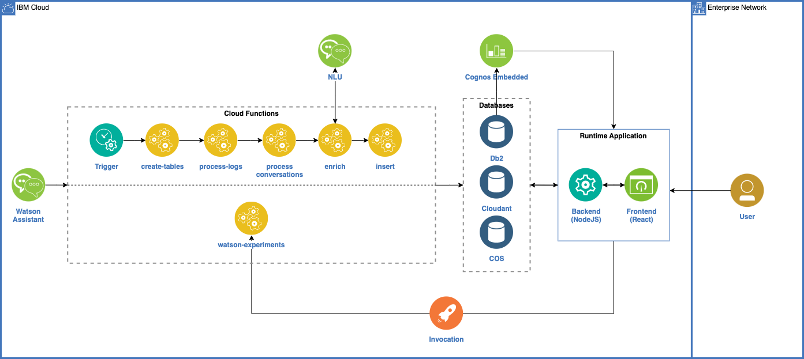

## **Sobre o Asset**

Este asset foi projetado para atuar como plataforma de curadoria de Watson Assistants. São realizadas análises sob duas diferentes perspectivas:

- **Qualidade do treinamento de intenções:** verifica-se o entendimento do assistente a respeito das intents nele cadastradas, apontando a precisão média e específica do assistente, além de levantar possíveis causas de erro;

- **Desempenho histórico:** através dos logs de conversas anteriores do assistente com seus clientes, são levantados dados sobre como está seu desempenho, como por exemplo: quantidade de conversas não atendidas (transferidas para atendente humano ou não), volume histórico de conversas, feedback recebido, intenções mais acessadas, entre outros.

## Realizando o Deployment dos Recursos

Essa documentação explica os detalhes do funcionamento do asset. Para visualizar a documentação de Deployment dos recursos acesse o arquivo `terraform/README.md` que está junto com os códigos.

## **Arquitetura**

O asset está estruturado em três momentos:

1. Uma sequência de [**cloud functions**](https://cloud.ibm.com/docs/openwhisk) que atua na plataforma da IBM Cloud em intervalos de tempo definidos recebendo, transformando e armazenando os logs do assistente;

2. Uma outra função, também deployada como [**cloud function**](https://cloud.ibm.com/docs/openwhisk), responsável por rodar testes avaliando a compreensão do assistente a respeito de suas intents;

3. Um frontend em que o curador pode avaliar o assistente, visualizando e confeccionando [**Dashboards**](https://cloud.ibm.com/docs/cognos-dashboard-embedded?topic=cognos-dashboard-embedded-gettingstartedtutorial) gerados a partir dos dados extraídos.

A sequência de cloud functions (1) se comunica com o assistente através do método [_listLogs()_](https://cloud.ibm.com/apidocs/assistant-v1?code=node#listlogs) da [API v1](https://cloud.ibm.com/apidocs/assistant-v1) do Watson Assistant. Uma vez com todos os logs, a sequência realiza as seguintes tarefas:

1. Retira informações consideradas como as mais relevantes para a tarefa de curadoria no **nível do log**:

   - ID do usuário que com quem o assistente estava conversando;
   - ID da conversa a qual este log pertence;
   - ID do log em questão;
   - A mensagem enviada pelo cliente e a hora que esta foi recebida;
   - A resposta dada pelo assistentee a hora que esta foi entregue;
   - O título do _node_ da árvore de diálogo do assistente acionado nesta transação;
   - As intenções compreendidas pelo assistente nessa transação;
   - A confiança que o assistente tem na intenção que escolheu como principal (valor numérico);
   - As entidades compreendidas pelo assistente nessa transação;

2. Agrupa os logs em conversas de acordo com o _conversationID_ que este carrega e:

   - Classifica se o meio utilizado na conversa foi telefônico ou por troca de mensagens;
   - Dá a data e hora do início da mesma;
   - Salva a duração todal da mesma (em segundos);
   - Salva, se houver, a nota de feedback que o assistente recebeu do cliente;
   - Analisa e salva se a conversa foi ou não transferida para atendente humano;
   - Classifica se a conversa é relevante com base na existência ou não de certas intents em algum dos logs participantes;
   - Indica se esta conversa é o primeiro contato do cliente com o assistente ou não.

3. Para as conversas realizadas através de telefone, armazena dados referentes ao número e IP do usuário e também se houve interrupções de voz por parte do cliente (cliente falando "em cima" do assistente)

4. Para todas as conversas, armazena também as variáveis de ambiente geradas no decorrer da mesma, classificando o seu tipo de dado (Ex.: "string", "object", "boolean", etc.)

5. Manipulados os logs dessa forma, a sequência finaliza inserindo-os em três bases de dados:[ **Cloudant**](https://cloud.ibm.com/docs/Cloudant?topic=Cloudant-client-libraries#client-libraries), [**COS (Cloud Object Storage)**](https://cloud.ibm.com/docs/cloud-object-storage?topic=cloud-object-storage-getting-started-cloud-object-storage) e [**Db2**](https://cloud.ibm.com/docs/Db2onCloud?topic=Db2onCloud-getting-started)

A cloud function de avaliação de treinamento (2) lista as intents e seus respectivos exemplos através do método [_listIntents()_](https://cloud.ibm.com/apidocs/assistant-v1?code=node#listintents) do Watson Assistant. Aleatoriamente, ela então seleciona alguns exemplos para serem retirados de determinadas intents, criando novos assistentes treinados com estes exemplos "defasados". Conversando com estes assistentes, são extraídas as precisões gerais de suas respostas. As médias de acertos e erros destes assistentes dão um bom embasamento para determinar o quão "forte" é o entendimento do assistente original a respeito de suas intents.

Através de conexão do [**Db2**](https://cloud.ibm.com/docs/Db2onCloud?topic=Db2onCloud-getting-started) com o [**Cognos**](https://cloud.ibm.com/docs/cognos-dashboard-embedded?topic=cognos-dashboard-embedded-gettingstartedtutorial), torna-se possível gerar gráficos das informações armazenadas.

Além dessas visualizações gráficas, o frontend também conta com uma página em que o curador pode buscar mensagens que tenham despertado determinada intent. É dada a opção para que seja atribuída uma nota do quão satisfeito está com a resposta do assistente.

## **Pre-requisitos**

Para continuar com esta documentação, é necessário possuir uma conta na [**IBM Cloud**](https://cloud.ibm.com/).

Também é necessário uma instância do Watson Assistant, com um assistente deployado e alguns logs de conversas com o mesmo disponíveis (de padrão, os logs de assistentes dos planos Lite e Plus ficam armazenados apenas por 30 dias).

São necessárias intâncias do [**Cloudant**](https://cloud.ibm.com/docs/Cloudant?topic=Cloudant-ibm-cloud-public), [**COS**](https://cloud.ibm.com/docs/cloud-object-storage?topic=cloud-object-storage-getting-started-cloud-object-storage) e [**Db2**](https://cloud.ibm.com/docs/Db2onCloud?topic=Db2onCloud-getting-started). Recomenda-se a realização do deploy de todas elas na própria IBM Cloud, utilizando os scripts de terraform disponíveis neste mesmo repositório.

Para a realização da extração de sentimento das mensagens enviadas pelo cliente, também é necessário instanciar o serviço do [**NLU**](https://cloud.ibm.com/docs/natural-language-understanding?topic=natural-language-understanding-getting-started).

O último serviço a ser instanciado na IBM Cloud é o [**Cognos Embedded**](https://cloud.ibm.com/docs/cognos-dashboard-embedded?topic=cognos-dashboard-embedded-gettingstartedtutorial), responsável pelos Dashboards a ser construídos e apresentados no front.

Conhecimento de como fazer upload de código como [**cloud function**](https://cloud.ibm.com/docs/openwhisk) na IBM Cloud é recomendado, mas este processo também acontecerá de forma automatizada através de um script do [**terraform**](https://www.terraform.io/docs).

Por último, por gentileza certifique-se de que [**Docker**](https://docs.docker.com/get-docker/) (ou alguma solução de containerização correlata) está instalado em sua máquina, uma vez que precisaremos do mesmo para carregar alguns containers e arquivos.

## **Componentes**

Conforme acima, este asset é composto por duas principais partes:

### **Sequência de cloud functions**

Composta de 5 funções diferentes, a sequência está organizada de forma que o output da primeira seja o input da seguinte e por aí em diante. São elas:

- **create-tables-cf**

  Cria, se necessário, as tabelas que receberão os logs processados na instância do Db2 especificada.

- **process-logs-cf**

  Realiza a extração de informações no nível do log (Etapa 1 descrita no tópico de arquitetura)

- **process-conversations-cf**

  Agrupa os logs no nível da conversa e extraí informações no nível da conversa (Etapas 2 e 3)

- **enrich-cf**

  Consulta o [**NLU**](https://cloud.ibm.com/docs/natural-language-understanding?topic=natural-language-understanding-getting-started) para extrair o sentimento do texto, armazenado sob forma numérica variando entre **-1**, para sentimentos negativos, e **+1**, para sentimentos positivos. Além disso, nesta função é realizada a extração das variáveis de contexto das conversas (Etapa 4)

- **insert-logs-cf**

  A partir dos objetos gerados nas funções anteriores, nesta etapa final é realizada a comunicação com as três bases de dados: [**Cloudant**](https://cloud.ibm.com/docs/Cloudant?topic=Cloudant-ibm-cloud-public), [**COS**](https://cloud.ibm.com/docs/cloud-object-storage?topic=cloud-object-storage-getting-started-cloud-object-storage) e [**Db2**](https://cloud.ibm.com/docs/Db2onCloud?topic=Db2onCloud-getting-started). No Cloudant e COS são armazenados os logs a fim de manter backup dos mesmos, no Db2 temos o armazenamento das informações relevantes filtradas e geradas pelas funções (Etapa 5)

### **Interface do curador**

A interface do curador tem as seguintes principais funcionalidades:

- Apresentar graficamente a qualidade do entendimento do assistente (sua precisão de acerto) a respeito das intents nele cadastradas dados os exemplos atuais.

- Permitir busca de logs a partir de data ou intent e apresentá-las para atribuição de nota humana;

- Disponibilizar uma interface para a construção e consulta de dashboards interativos que apresentem o desempenho do assistente no decorrer do tempo.

A interface do curador se comunica com a instância do Db2 através do [**ibm_db**](https://www.npmjs.com/package/ibm_db), pacote para Node que funciona como API da instância de Db2 selecionada.

A comunicação com o a instância do Cognos Embedded também se dá através de sua API, cuja documentação está disponível nos seguintes links: [**CognosApi Docs**](https://dde-us-south.analytics.ibm.com/daas/jsdoc/cognos/api/CognosApi.html), [**CognosApi File**](https://dde-us-south.analytics.ibm.com/daas/CognosApi.js).

## **Como realizar o Deployment**

Para a documentação sobre como realizar o deploy dos serviços necessários para o funcionamento deste asset, por gentileza consulte o guia encontrado no arquivo `terraform/README.md` dos arquivos baixados.

## **Guia do Usuário**

### Login

Ao acessar a página de login, clique no botão para gerar o token, que abrirá uma nova página.

Na nova página, faça o login usando o acesso da IBM Cloud, e copie o token gerado. Feche a página e cole o token gerado na tela de login para fazer o acesso.

Ao efetuar login, a interface automaticamente verifica se, dentre os assistentes cadastrados anteriormente, existe algum que o usuário tenha acesso.

### Homepage

A primeira tela do Assistant Curator é uma Homepage que nos trás uma breve explicação das principais páginas do Asset e um link para cada uma delas.

A tela contém um menu lateral para navegação do usuário, além de um botão de ajuda no canto inferior direito que abre um modal com uma sugestão passo a passo de como executar o processo de curadoria do Assistant. Esse modal pode ser acessado em qualquer página do Assistant Curator.

Observe que no header há um menu em formato de lista que apresenta o assistente atualmente selecionado. Todos os dados que estão sendo apresentados na interface dizem respeito a este assistente. Para fazer curadoria de outro, basta selecioná-lo no menu:

### Intent Training Quality

Essa tela apresenta os gráficos baseados em dados dos experimentos realizados analisando as intenções, seus respectivos exemplos e a árvore de conversação do Assistente.

### Intent Search

Essa tela nos traz uma visualização da troca de mensagens entre cliente e assistente, possibilitando buscas por data e/ou por intent. É possível avaliar estas mensagens, enriquecendo nossa análise com uma nota de satisfação do próprio curador.

### Conversation Performance

Nesta página temos a interface do Dashboard interativo. Esses gráficos contêm os principais dados sobre o seu Assistant e foram construídos pensando em trazer os dados mais importantes para entender como está o desempenho do seu Assistant.

As visualizações apresentadas podem ser alteradas para melhor atenderem a análise desejada para seu caso de uso. Qualquer modificação pode ser salva a fim de possibilitar coexistência de diferentes versões do dashboard.

